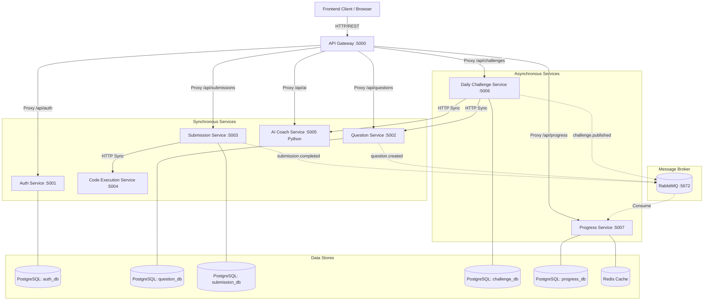

# Axly Microservices Architecture Audit

This document serves as the final production-readiness audit for the Axly Microservices project (Phase 5).

## 1. Complete Architecture Diagram

## 2. Service List and Responsibilities

| Service | Stack | Responsibility | Port |
|---------|-------|----------------|------|
| **API Gateway** | Node.js/Express | Centralized ingress, JWT auth verification, rate limiting, routing. | 5000 |
| **Auth Service** | Node.js/Express | User registration, password hashing (bcrypt), JWT generation, RBAC. | 5001 |
| **Question Service** | Node.js/Express | Canonical ownership of DSA problems, difficulty metadata, test cases. | 5002 |
| **Submission Service** | Node.js/Express | Orchestrates user code submission, coordinates with Execution service, logs history. | 5003 |
| **Execution Service** | Node.js/Express | Highly isolated, sandboxed environment (using `child_process`) for evaluating untrusted user code. | 5004 |
| **AI Service** | Python/FastAPI | RAG abstractions, Langchain fallback routers, question generation, and coaching. | 5005 |
| **Daily Challenge** | Node.js/Express | Cron-driven scheduler for automatically publishing AI-generated DSA challenges daily. | 5006 |
| **Progress Service** | Node.js/Express | Asynchronous consumer calculating global leaderboards and user scores via Redis caching. | 5007 |

## 3. Database Ownership Map

**Strict Validation:** Zero cross-service database access was found.
* `auth_db` ➔ Owned strictly by `Auth Service`. Stores `User` schema.
* `question_db` ➔ Owned strictly by `Question Service`. Stores `Question` schema.
* `submission_db` ➔ Owned strictly by `Submission Service`. Stores `Submission` schema.
* `challenge_db` ➔ Owned strictly by `Daily Challenge Service`. Stores `DailyChallenge` references.
* `progress_db` ➔ Owned strictly by `Progress Service`. Stores `UserProgress` schema.

## 4. API Communication Map

- **External (Client ➔ Gateway)**: Standard REST over HTTP.
- **Synchronous Internal**:
  - `Submission Service ➔ Code Execution Service`: POST `/execute` (Code evaluation must be synchronous to respond to client).
  - `Challenge Service ➔ AI Service`: POST `/generate` (Awaiting LLM completion).
  - `Challenge Service ➔ Question Service`: POST `/` (Persisting generated challenge to canonical DB).

## 5. Event Map (RabbitMQ)

Our event-driven bus uses topic exchanges allowing idempotent pub-sub.

| Event Topic | Emitter | Consumer(s) | Payload Data |
|-------------|---------|-------------|--------------|
| `submission.completed` | Submission Service | Progress Service | `submissionId`, `userId`, `status` |
| `question.created` | Question Service | (Future) Search Indexer | `questionId`, `title` |
| `challenge.published` | Daily Challenge | (Future) Notification Service | `challengeId`, `questionId`, `date` |
| `user.progress.updated` | Progress Service | (Future) WebSocket Service | `userId`, `newScore` |

## 6. Test Results & CI/CD

All tests were stabilized for CI/CD integration:
- **Unit Tests**: Integrated `jest` utilizing isolated mocked dependencies or ephemeral PostgreSQL containers via GitHub Actions.
- **AI Tests**: Configured `pytest` passing all 5 LLM-routing tests.
- **E2E Tests**: A full suite (`tests/e2e/api.e2e.test.ts`) orchestrates HTTP requests against `localhost:5000` verifying cross-service integration and RabbitMQ leaderboard updates.
- **Security Check**: Execution Service strictly utilizes buffers and timeouts to kill infinite loops and prevent untrusted fs/network access.

## 7. Remaining Risks & Considerations

1. **Gateway Single Point of Failure**: The Node.js Express Gateway handles all ingress. If it fails, the entire application drops. *Recommendation: Introduce NGINX or AWS ALB in front of multiple gateway replicas.*
2. **Execution Sandbox Escapes**: While `child_process` execution utilizes basic timeouts and limits, a sophisticated attacker could still perform prototype pollution or exhaust memory. *Recommendation: Transition from local `child_process` to containerized sandboxes (e.g., gVisor, Firecracker microVMs) for Production.*
3. **Database Migrations**: Currently, Prisma `db push` is executed sequentially in CI. For zero-downtime deployments, we must transition to `prisma migrate deploy` paired with backwards-compatible schema changes.
4. **AI Rate Limits**: The AI Service utilizes basic HTTP retries for Anthropic/OpenAI, but under high load (e.g., hundreds of users asking for hints), we will hit API provider rate limits. *Recommendation: Introduce an internal rate-limit queue in the AI Service.*
